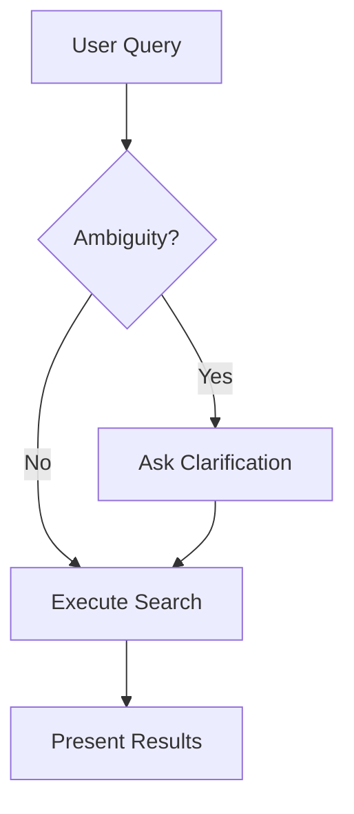

# Technical Improvements Checklist

**Status:** Suggestions for enhancing the Airbnb AI case study
**Priority:** Optional enhancements beyond core deliverable
**Owner:** Adedayo Agarau

---

## ✅ Completed

- [x] All personal contact information updated
- [x] Broken internal links fixed in microcopy guide
- [x] Files committed to Git repository
- [x] Notion formatting instructions provided

---

## 🎯 Quick Wins (1-2 hours each)

### 1. Create Notion Template Preview
**What:** Import airbnb-notion-complete.md to Notion, format perfectly, share public link
**Why:** Let viewers see finished product without importing themselves
**How:**
1. Create new Notion page
2. Copy content from airbnb-notion-complete.md
3. Apply all [NOTION FORMAT] instructions
4. Share page with "Allow duplicate as template"
5. Add link to README.md

**Impact:** ⭐⭐⭐⭐⭐ (High visibility, low effort)

---

### 2. Add File Metadata Headers
**What:** Add YAML frontmatter to each .md file
**Example:**
```yaml
---
title: Airbnb AI Case Study
author: Adedayo Agarau
date: 2025-12-15
version: 1.0
status: Complete
tags: [conversation-design, AI, content-strategy]
---
```

**Why:** Better organization, searchability, professional polish
**Impact:** ⭐⭐⭐ (Nice to have)

---

### 3. Add GitHub Badges to README
**What:** Add visual badges for project status
**Example:**
```markdown


```

**Why:** Professional polish, quick visual status
**Impact:** ⭐⭐ (Nice visual touch)

---

## 🎨 Medium Effort (4-8 hours each)

### 4. Create Visual Diagrams
**What:** Replace ASCII art with professional diagrams
**Tools:** Mermaid.js (renders in GitHub), Figma, or Lucidchart
**Diagrams needed:**
- System architecture (4 layers)
- AI decision tree (when to intervene)
- Dialogue flow examples (2-3 key scenarios)
- User journey map (pre-booking → during stay → post-stay)

**Example (Mermaid.js):**


**Why:** More professional, easier to understand
**Impact:** ⭐⭐⭐⭐ (Significantly improves clarity)

---

### 5. Create Quick-Start Video
**What:** 30-60 second screen recording showing Notion import
**Content:**
1. Create Notion page
2. Copy first section
3. Add callout box
4. Add toggle
5. Insert table of contents
6. Show final result

**Tools:** Loom, QuickTime, OBS
**Format:** GIF or embedded video
**Impact:** ⭐⭐⭐⭐ (Reduces friction significantly)

---

### 6. Build Slide Deck Summary
**What:** 15-20 slide presentation version
**Suggested outline:**
- Slide 1: Title + contact
- Slides 2-3: Problem statement
- Slides 4-6: System architecture
- Slides 7-10: Key dialogue flows (show 2-3 examples)
- Slides 11-13: Microcopy highlights
- Slide 14: Projected impact metrics
- Slide 15: Production gaps (honest assessment)
- Slide 16: Contact + portfolio link

**Tools:** Google Slides, Keynote, or Pitch
**Use case:** Interview presentations, portfolio walk-throughs
**Impact:** ⭐⭐⭐⭐⭐ (Essential for interviews)

---

## 🚀 Advanced (1-2 days each)

### 7. Interactive Prototype
**What:** Clickable prototype of dialogue flows
**Tools:** Figma, ProtoPie, or Framer
**Scope:**
- 2-3 key dialogue flows
- Interactive conversation bubbles
- Show AI decision-making in real-time
- Mobile responsive

**Why:** Shows design in action, not just theory
**Impact:** ⭐⭐⭐⭐⭐ (Portfolio standout piece)

---

### 8. Video Walkthrough
**What:** 5-10 minute narrated walkthrough
**Content:**
- Introduce yourself + project context
- Walk through system architecture
- Demonstrate 2 dialogue flows
- Explain key content strategy decisions
- Discuss production gaps honestly
- Show microcopy examples

**Tools:** Loom, Descript, or Camtasia
**Format:** Unlisted YouTube video or Vimeo
**Use case:** Send to recruiters, embed in portfolio
**Impact:** ⭐⭐⭐⭐⭐ (Personal touch, explains thinking)

---

### 9. User Testing Plan Document
**What:** Detailed plan for validating designs
**Include:**
- Research questions
- Participant recruitment criteria
- Usability testing protocol
- Interview scripts
- Success metrics
- Timeline and budget

**Why:** Shows you understand gap between design and validation
**Impact:** ⭐⭐⭐⭐ (Demonstrates maturity)

---

## 📊 Analytics & Tracking

### 10. Add View Tracking
**What:** Track how many people view your portfolio
**Tools:**
- GitHub: Built-in traffic analytics
- Notion: Embed Google Analytics
- Portfolio site: Use Plausible or Simple Analytics

**Why:** Understand engagement, optimize content
**Impact:** ⭐⭐ (Informational only)

---

## 🎯 Prioritization Matrix

### Must-Have (Do First)
1. ✅ Create Notion template preview - **Highest ROI**
2. ✅ Build slide deck summary - **Essential for interviews**
3. ✅ Create visual diagrams - **Significantly improves clarity**

### Should-Have (Do Soon)
4. Create quick-start video - **Reduces friction**
5. Video walkthrough - **Personal touch**
6. Interactive prototype - **Portfolio standout**

### Nice-to-Have (Do If Time)
7. File metadata headers
8. GitHub badges
9. User testing plan
10. Analytics tracking

---

## 🛠️ Implementation Order

### Phase 1: Portfolio Ready (1 week)
- [ ] Import to Notion and format perfectly
- [ ] Share Notion template link
- [ ] Update README with Notion link
- [ ] Create slide deck (15-20 slides)

### Phase 2: Interview Ready (2 weeks)
- [ ] Record video walkthrough (5-10 min)
- [ ] Create visual diagrams (Mermaid or Figma)
- [ ] Practice presenting slide deck

### Phase 3: Portfolio Standout (1 month)
- [ ] Build interactive prototype
- [ ] Create quick-start video/GIF
- [ ] Add GitHub badges
- [ ] Write user testing plan

---

## 💰 Budget Considerations

**Free tools:**
- Mermaid.js (diagrams)
- Loom (video, free tier)
- Google Slides (presentation)
- Figma (free tier)
- OBS (screen recording)

**Paid tools (optional):**
- Figma Pro: $12/month (advanced prototyping)
- Descript: $12/month (video editing with transcription)
- Pitch: $8/month (beautiful slides)
- ProtoPie: $13/month (advanced interactions)

**Recommended:** Start with free tools, upgrade only if needed

---

## 📈 Success Metrics

**How to measure impact of improvements:**

- **Notion template:** Views, duplicates
- **Slide deck:** Interview requests, presentation invitations
- **Video walkthrough:** View time, completion rate
- **Interactive prototype:** Time spent, screens explored
- **Overall:** Portfolio views → Interview requests → Offers

**Goal:**
- 20+ portfolio views/month
- 5+ meaningful conversations with recruiters
- 2+ interview requests from case study alone

---

## 🤝 Getting Help

**If you need assistance with:**
- **Diagrams:** Fiverr ($20-50 for professional diagrams)
- **Video editing:** Upwork ($30-100/hr for editing)
- **Slide design:** Canva templates (free) or hire designer ($50-200)
- **Prototype:** Figma community has free templates

**DIY resources:**
- Figma YouTube tutorials
- Mermaid.js documentation
- Notion template gallery
- Portfolio case study examples on Behance

---

## 📝 Current Status Summary

**What's complete:**
- ✅ Core case study (90 pages, 80K words)
- ✅ Comprehensive microcopy guide (200+ examples)
- ✅ Notion formatting instructions
- ✅ README with quick start
- ✅ Contact info updated
- ✅ Git repository with clean history

**What's next:**
1. Import to Notion (highest priority)
2. Create slide deck (for interviews)
3. Consider other improvements based on time/interest

**Bottom line:** Your case study is **portfolio-ready as-is**. These improvements are optional enhancements to stand out even more.

---

**Last updated:** 2025-12-15
**Author:** Adedayo Agarau
**Status:** Suggestions for future iteration
